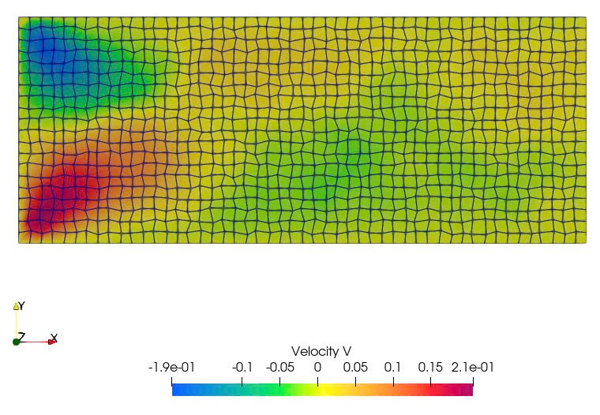

Unstructured solver for incompressible, low Reynolds number flow. There are 4 cases are covered in this code, including:

(0) Lid-driven cavity flow.

(1) Flow through airfoil.

(2) Channel flow (Poiseuille flow)

(3) Heat conduction.

Mesh Generator:
  - Delauney method for channel flow.

Numerical scheme:
  - SIMPLE algorithm.
  - 1st order upwind spatial scheme for convective terms.
  - 2nd order scheme for diffusion terms.
  - PWIM scheme for flux calculations.

Result:

(2) Chanel flow (Re=10).

  

  

  

(1) Airfoil flow

  

